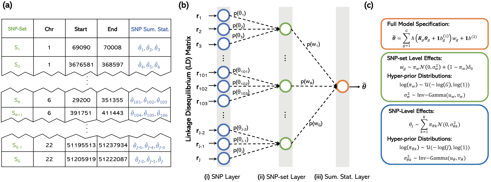

# Biologically Annoted Nerual Networks (BANNs)

**BANNs** are a class of feedforward Bayesian models with partially connected architectures that are guided by predefined SNP-set annotations.
 
 ## Installation and Dependencies
 
 We implement BANNs in three different software packages. The first two are implemented in Python using Tensorflow and numpy, respectively. The third version is implemented in R. The dependencies and requirements needed to install and run each version of the BANN software may be found in the README of the corresponding subdirectories. 
 
 ## Tutorial and Examples
 
 For each version of the software, we also provide example code and a toy dataset which illustrate how to use BANNs and conduct multi-scale genomic inference. 

## Background 

The BANN framework simply requires **_individual-level_** genotype/phenotype data and a predefined list of SNP-set annotations (see first schematic below). This translates to the following inputs for the software:
* `X`: Genotype matrix of size N-by-P, where N is the number of individuals and P is the number of SNPs.
* `y`: Phenotype file of N rows, where N is the number of individuals and each row stores the continuous phenotypic value. 
* `mask`: Mask matrix of size P-by-G, where P is the number of SNPs and G is the number of SNP-sets (e.g., genes). Each column is a vector filled with 0s and 1s, where 1 indicates that the given SNP in that row belongs to the gene in that column.  

The method can also take in **_summary statistics_** where SNP-level effect size estimates are treated as the phenotype and an estimate of the linkage disequilibrium (LD) matrix is used as input data. This translates to the alternative inputs for the software:
* `X`: LD matrix of size P-by-P, where P is the number SNPs.
* `y`: SNP-level effect sizes for each of the P SNPs, often derived by using a single-SNP GWAS method (e.g., ordinary least squares). 
* `mask`: Mask matrix of size P-by-G, where P is the number of SNPs and G is the number of SNP-sets (e.g., genes). Each column is a vector filled with 0s and 1s, where 1 indicates that the given SNP in that row belongs to the gene in that column. 

Structurally, sequential layers of the BANN model represent different scales of genomic units:
* The first layer of the network takes SNPs as inputs, with each unit corresponding to information about a single SNP.
* The second layer of the network represents SNP-sets.

The interpretation of the second point naturally arises from the fact that all SNPs that have been annotated for the same SNP-set are connected to the same neuron in the second layer.

## Probabilistic Details about the BANN Framework

We frame the BANN methodology as a Bayesian nonlinear mixed model with which we can perform classic variable selection. Some unique aspects about the model include:
* We leverage the fact that using nonlinear activation functions for the neurons in the hidden layer implicitly account for both additive and non-additive effects between SNPs within a given SNP-set 
* The weights and connections of the neural network as random variables with sparse prior distributions that reflect how genetic effects are manifested at different genomic scales.
* We use a variational expectation-maximization (EM) algorithm to infer posterior inclusion probabilities (PIPs) for SNPs and SNP-sets. This algorithm is very similar to that proposed by [Cabronetto and Stephens (2012)](https://projecteuclid.org/euclid.ba/1339616726).

Details and statistical derivations of the BANN framework can be found in Methods and Supplementary Notes of the citation below.

## Other Notes on the Software

* Please make sure that the order of individuals (rows) in the genotype matrix `X` matches the order of individuals in the phenotype file `y`.
* Please make sure that the SNP order (i.e., the columns) of genotype matrix `X` is the same as order in the mask file (i.e., the rows). 
* We report the results according to the order of these input files. For example, the PIPs for SNP-set will be returned in the same way that they were ordered in the mak file (i.e., along the columns). 

## RELEVANT CITATIONS

P. Demetci*, W. Cheng*, G. Darnell, X. Zhou, S. Ramachandran, and L. Crawford. Multi-scale Genomic Inference using Biologically Annotated Neural Networks. _biorxiv_.

## QUESTIONS AND FEEDBACK
For questions or concerns with BANN software, please contact [Pinar Demetci](mailto:pinar_demetci@brown.edu), [Wei Cheng](mailto:wei_cheng1@brown.edu), or [Lorin Crawford](mailto:lorin_crawford@brown.edu).

We welcome and appreciate any feedback you may have with our software and/or instructions.

